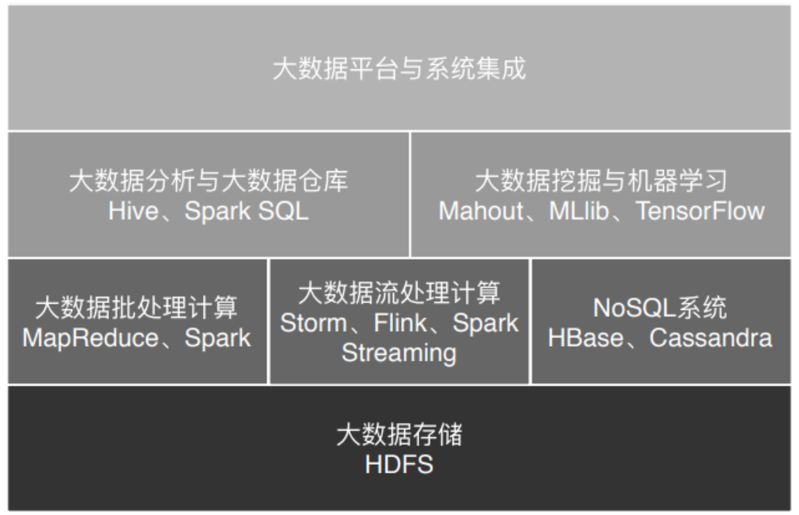

## 历史

1. **【论文】**2004年左右，Google发表了论文。3件套。
   1. 分布式文件系统 GFS
   2. 分布式计算框架 MapReduce
   3. NoSQL数据库 BigTable
2. **【HDFS、MapReduce】**两年后2006年，Dong Cutting从Nutch项目分离了出，并最终逐渐演化成Hadoop。
   1. 分布式文件系统HDFS
   2. 大数据计算引擎MapReduce
3. 2007年，阿里、百度开始使用。Yahoo在项目初期就开始使用。
4. 2008年，Hadoop成为Apache顶级项目。Dong Cutting也成为Apache基金会主席。2008年，Cloudera公司成立，专门运营Hadoop项目。
5. **【Pig脚本】**Yahoo用这MapReduce太麻烦，于是开发Pig脚本语言，类似SQL。编译后生成MapReduce程序，能在Hadoop上运行。
6. **【Hive】**Facebook觉得Pig还得新学个脚本语言，不如直接写SQL。于是，开发了Hive。你就可以直接写SQL语法来进行大数据计算。比如，写个select，hive就把sql转为MapReduce的计算程序。
7. 2011年，Facebook大数据平台上的作业90%都源于hive。
8. 【大数据生态发展】大家纷纷写周边来玩大数据。
   1. 关系型数据库的数据导入Hadoop的Sqoop
   2. 大规模分布式收集、聚合、传输日志Flume
   3. MapReduce工作流调度引擎Oozie
   4. 等
9. 【NoSQL】2011年，火爆的NoSQL数据库HBase、Cassanda。那个时候阿里也在做自己的NoSQL系统。
10. **【Yarn】**2012年，MapReduce即是执行引擎，又是资源调度框架。职责不单一。不利于资源复用。MapReduce臃肿。Yarn诞生，最主流的资源调度系统。
11. 【Spark】2012年，UC伯克利AMP实验室写了Spark。因马铁博士发现MapReduce做机器学习时性能差。
    1. MapReduce每次作业都要重新启动一次作业。机器学习算法通常需要多次迭代计算。
    2. MapReduce用磁盘存储。2012年，内存容量与价格性价比更高更快。

## *大数据引擎* （*大数据框架*）分类

> 历史全量数据用批处理，增量数据用流计算。

1. 批处理计算（大数据离线计算）
   1. MapReduce
   2. Spark
   3. Flink
2. 流计算（大数据实时计算）
   1. Storm
   2. Flink
   3. Spring Streaming

## 大数据场景

> 机器学习的理解上，推荐一本书《智能时代》。去年读完。

1. 数据分析
   1. hive
   2. Spark SQL
2. 数据挖掘
3. 机器学习
   1. TensorFlow
   2. Mahout
   3. MLib
   4. 他们内置了主要的机器学习和数据挖掘算法。

## 数据量大就不要移动数据了！

> 通常后端业务，数据小但高频，一次一次的小数据高频地通过网络传输到服务器。
>
> 也就是我们通常的软件程序模型：*输入 - 计算 - 输出*
>
> ···
>
> 日积月累，精卫填海，渐渐有了存量数据。少则TB，多则PB。2017年新闻，亚马逊用*数据卡车*运送EB级（1024PB）数据。因为卡车运送比网络传输快。
>
> ···
>
> 至此，我们要处理大数据，就让 *计算* 贴近数据。
>
> **数据量大就不要移动数据了！**

题外话的案例：

1. 协同过滤进行商品推荐（协同过滤是个啥？学下去，先记住。）
2. 统计分析，一件商品的历史走势。

*多增加机器就能多增加处理能力的平行扩容* 是分布式系统产生的思路。

1. 负载均衡
2. 分布式缓存
3. 分布式数据库
4. 分布式服务
5. 等等

然后，分布式技术不能处理存量离线数据和增量数据。

*计算* 贴近 *数据* 是如何实现的呢？

1. 通过大数据框架让计算程序分散到各个数据上。
2. 【框架 - 如何存？】分布式文件存储系统HDFS将文件分为块`Block`存储在集群上的服务器。
3. 【框架 - 如何指挥？】大数据计算引擎根据不同服务器的计算能力，在每台服务器上启动若干分布式`任务执行进程`。这些进程等待任务分配来执行。
4. 【**个人业务** - 做什么？】使用大数据计算框架支持的编程模型来编程。编写应用程序，打包。因是JVM，所以打个jar包处理。
   1. MapReduce的编程模型
   2. Spark的RDD编程模型（并不明白RDD是什么？学下去。）
5. 【框架 - 如何划分`任务量`？】大数据计算框架Hadoop或Spark用启动命令执行这个jar包。
   1. 执行引擎会解析数据的输入路径，根据输入数据的大小，将数据分片`split`，每一个数据片分配一个任务执行进程去处理。
6. 【框架 - 如何具体执行？】`任务执行进程`收到分配的`任务量`后，检查自己是否有任务对应的jar包。没有，去下载；有，通过反射方式加载程序jar包。
7. 【框架 - 如何具体执行？】加载程序jar包后，`任务执行进程`根据分配的数据片`split`的文件地址和数据在文件中的偏移量读取数据，然后把数据输入给应用程序进行执行。

至此，只是大数据计算的简单描述。

总结，因为大数据框架的出现，我们仅需要思考业务，而不用处理如何划分任务量、如何将自己的算法去具体执行。这降低了大数据开发的难度。同样，web框架，屏蔽了网络协议的复杂度，封装请求为对象。这也降低了web开发的难度。所以，如果仅停留在开发阶段，时间久了，会觉得简单无趣。但是实际上，对真实的网络世界，对真实的大数据处理世界，一无所知。

## 插曲 - OLAP 和 OLTP

联机事务处理OLTP（on-line transaction processing）、联机分析处理OLAP（On-Line Analytical Processing）

## 垂直伸缩 与 水平伸缩

> 事物总是相对的。

站在单机角度看，x86机器、小型机、大型机、超级计算机。单机的单个磁盘，单机的多个磁盘RAID。

此即为垂直伸缩。

站在单机角度，集群。HDFS分布式文件系统。

此即为水平伸缩。

范围放小，单磁盘到多磁盘同为水平伸缩。分布式讨论的数据同步，同样存在于多核cpu上。

### RAID

大致分为：

1. RAID 0 - 一次数据并发写入N块磁盘。并发读N块磁盘。无备份。
2. RAID 1 - 一份数据写两块磁盘。可靠性高。
3. RAID 10 - 结合0和1。N块磁盘平均分为N/2。数据同时写入两个N/2磁盘。并发读写N/2。
4. RAID 3 - 数据写入N-1份磁盘，剩余一个磁盘记录校验数据。但是记录校验数据的磁盘因为写太多，易坏。
5. RAID 5 - 校验数螺旋一次写入一个放入所有磁盘。避免易坏。
6. RAID 6 - 校验数（不同算法）一次写2个放入所有磁盘。避免2块磁盘损坏。

## 插曲

2020.03.25，京东没有入职成。因为我没有写我入职了客如云。

五味杂陈，依然憧憬未来。

读书。

## 滚雪球的故事：HDFS依然存储王者

> HDFS因先发优势而被广泛使用，因已经有海量数据在HDFS上，各种新算法、框架希望被广泛使用而兼容HDFS。

有关`存储`的2个指标，因数量量大的1个指标：

1. 读写速度
2. 可靠性
   1. 灾后恢复能力
3. 扩容能力

HDFS的读写思路与RAID相似。以此实现了高可用的读写。

1. DataNode
2. NameNode

## MapReduce即是编程模型又是计算框架

## MapReduce的一次数据流转

### shuffle -- 数据的合并与连接

