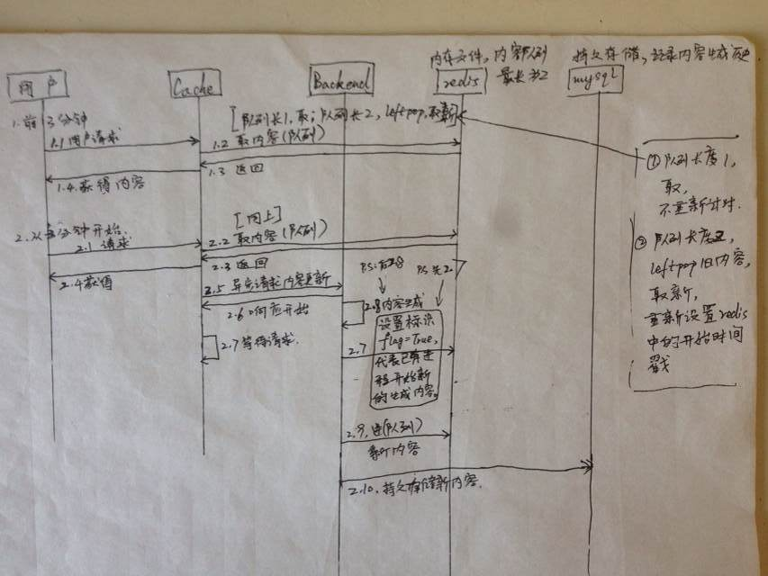

> 这是PDF答案，链接的答案稍后，
> 本来昨天就想用邮件直接发的，觉得还是有点乱，还是用md稍微整理格式。

> *p.s: 上面放的东西少，这个github我会慢慢维护起来。*

### 1. 问答题
#### a. 

```python

#coding=utf8

“”“
@note:
- 这个问题我最近有考虑。原因是我想把对mysql的访问，对单表做路由，实现单表数据分离。
- 实现最简单的负载均衡，就是生成最简单的散列值。

- 现实中的应用，nginx - upstream 就是这样的场景了.

- 下面展示伪代码：
”“”


# 假设, backend会增长，但是不会频繁变化，后端总数基本稳定为 N
COUNT_BACKEND = 9
# 假想，给予每一个backend编号，[1, 9] 的编号顺序

class simple_balance(object):
    “”“ 我们启动一个进程，转发GET请求 ”“”
    
    def GET(self):
        “”“ 依照 第几次请求，求余，就转发到对应的backend """
        
        # 初始化
        i = 0
        
        # 第几次请求
        i = i + 1
        
        # 只是担心溢出，但是基本不用考虑
        # i 以后还能作为一个简单地监控参数
        if i > 1000:
            i = 0
            
        # 求余，核心，生成散列
        out = i % COUNT_BACKEND
        
        # 求出对应backend
        url = 'http://backend_%s' % i
        
        # 转发GET请求，到对应的backend
        import requests
        requests.get(url)
```

#### b. 
 
总结需要完成的任务：

1. [x] 非硬编码，稳定地，转发相同请求，到，相同backend
2. [x] 负载要足够平均，不能有明显偏差
3. [x] 我自己的感受，如何定义  “什么是  相同的请求”？？


> - 问题3，我大致想了想：可以通过在请求中，明确参数 r_kind=?，明确定义“相同请求”。
> - 或许，是希望依照地理位置，访问当地的服务器，CDN？

> - 下面我给可能的解决方案，可能我没有完全理解题目，** 需要口头交流，讨论一下~~ **

```python
class simple_balance(object):
    """ 可呢的解决方案 ”“”
    
    def GET(self, r_kind=0):
        """ 假定，我们给出的 request-x 与 backend-y 的 f(x), 简单的是： x = y，这样就不是硬编码了 """
        
        url = 'http://backend_%s' % r_kind
        
        # 转发GET请求，到
        import requests
        requests.get(url)
```

#### c.
答：a, b 两种算法会有不同。

1. a 中，假如 backend编号0，宕机了。那么我们的所有业务请求  大部分请求正常，一小部分请求异常的情况。
   而异常 与 正常的比例，大致是 1：8（我刚刚假设了 9 台服务器）

2. b中，如果 backend-0，宕机。那么所有的 request-0 的业务请求，全部都会失败。
   而不会影响到其他的业务。

### 2. 问答题：
> 前提条件：
> 1. 至少5分钟刷新一次cache内容，并不严格要求时间.
> 2. backend生成内容10秒钟左右，并不严格要求时间。

#### 1. 解决方案1 -- 这是我一开始想到的方法：
> 核心想法：利用 异步请求，cache 主动 *提前*通知 backend生成内容，cache不必再等待 backend.
> 我在纸上，画了一个不太标准的时序图，大致能说明我的想法. 我一开始想复杂了，就画时序图说明吧



#### 2. 解决方案2：
> 核心想法：利用 消息队列，cache *提前* 分配任务，backend一旦发现任务，就生成新内容，然后更新
> 这个想法实现应该比较自然，celery+redis就可以

#### 3. 解决方案3：
> 核心想法：利用 crontab，cache并不主动从backend获取内容，backend每隔2分钟，主动生成一次新内容，放到redis中
> 这个实现起来方法最快


### 3. 编程题：

https://github.com/Kevin922/kevin922.github.io/blob/master/suanfa/change_str_to_ip.py


